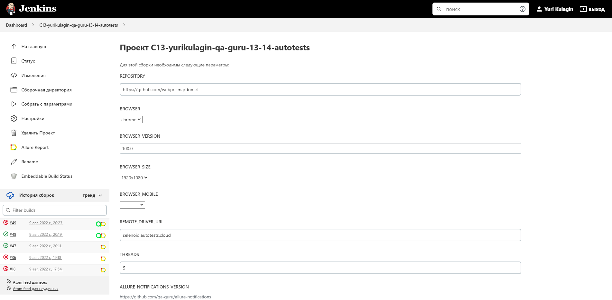
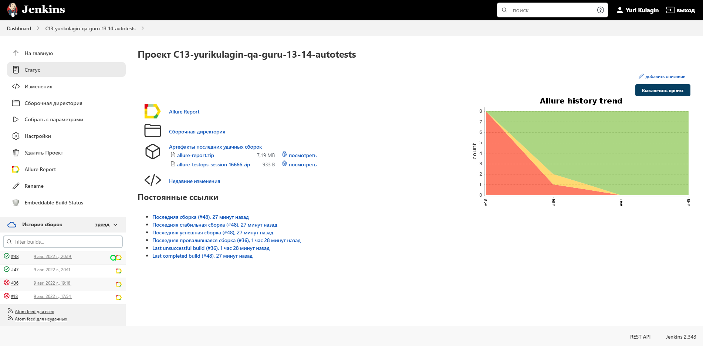
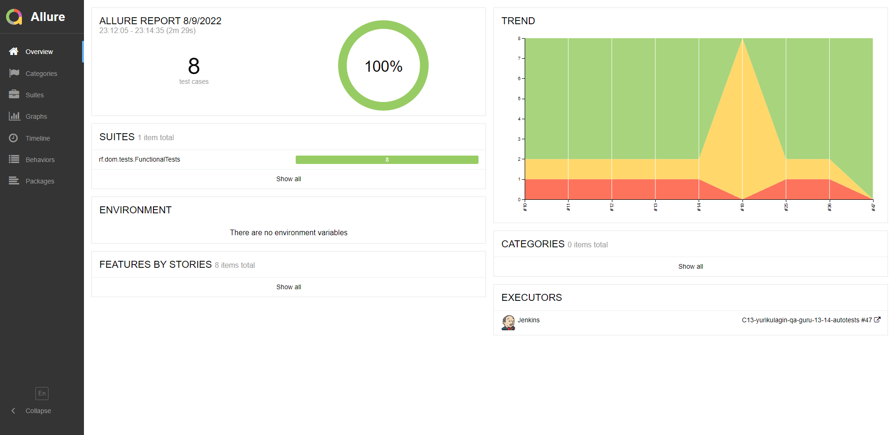
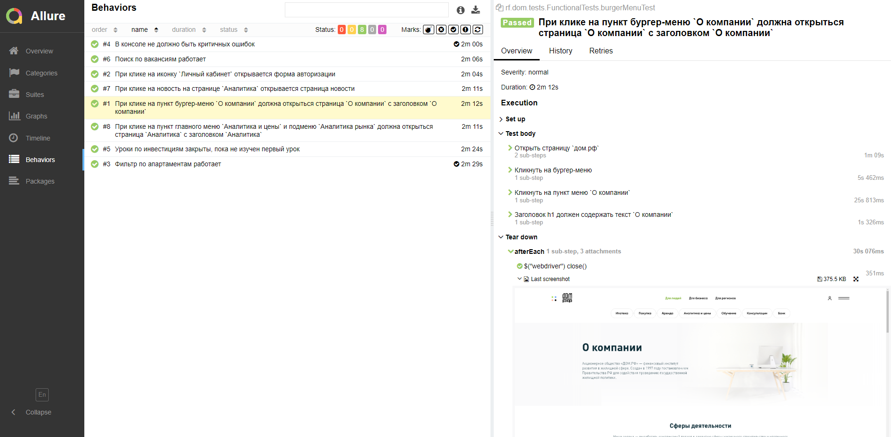
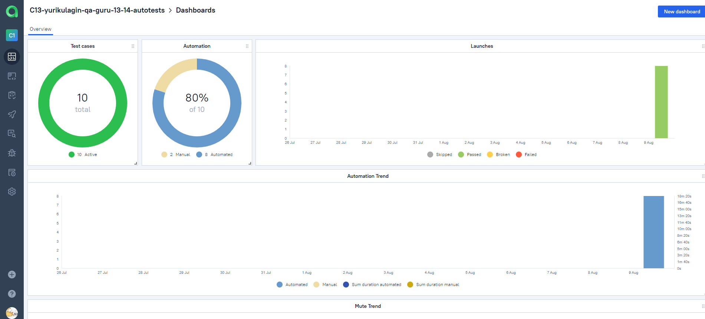
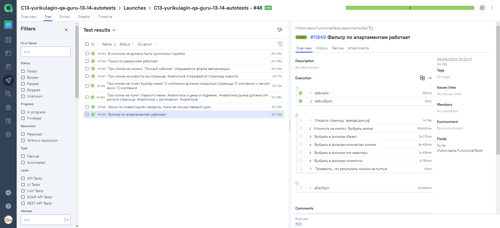
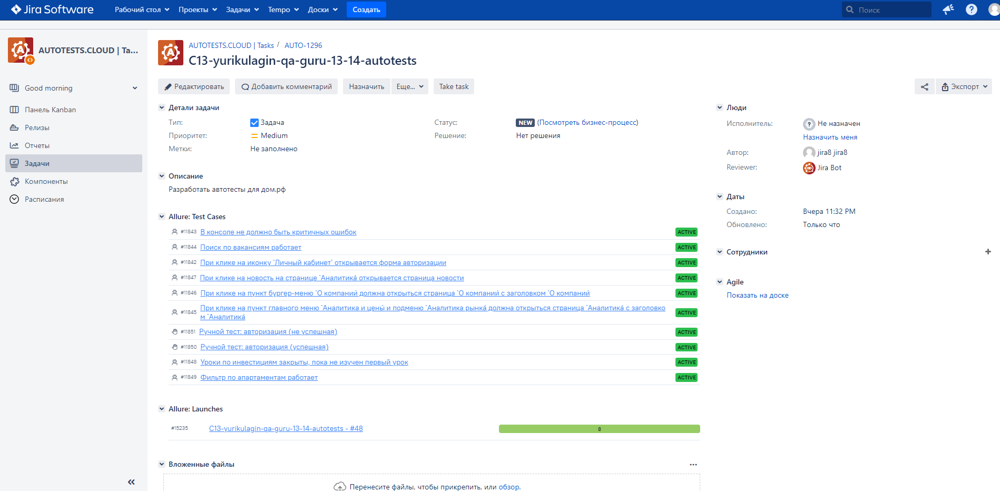
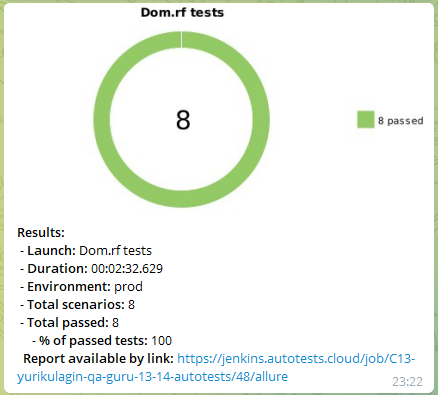

# Дипломная работа по курсу QA.GURU "Инженер автоматизации тестирования"

## :page_with_curl: Содержание:

- <a href="#computer-сode_stack">Технологии и инструменты</a>
- <a href="#clipboard-реализованные-проверки">Реализованные проверки</a>
- <a href="#robot-сборки-в-Jenkins">Сборки в Jenkins</a>
- <a href="#keyboard-запуск-из-терминала">Запуск из терминала</a>
- <a href="#bar_chart-allure-отчет">Allure отчет</a>
- <a href="#bar_chart-allure-testops-отчет">Allure TestOps отчет</a>
- <a href="#clipboard-пример-issue-в-jira">Пример Issue в JIRA</a>
- <a href="#robot-отчет-в-telegram">Отчет в Telegram</a>
- <a href="#film_projector-видео-пример-прохождения-тестов">Видео пример прохождения тестов</a>

## :computer: Технологии и инструменты
<p align="left">


</p>

## :clipboard: Реализованные проверки

- UI тесты сайта wildberries.ru
- API тесты reqres.in
- Мобильные тесты приложения Wildberries

## :robot: Сборки в Jenkins
### <a target="_blank" href="https://jenkins.autotests.cloud/job/C13-yurikulagin-qa-guru-13-14-autotests/">Параметризированная сборка в Jenkins со всеми тестами</a>
<p align="center">

</p>
<p align="center">

</p>

## :keyboard: Запуск из терминала
Локальный запуск всех тестов:
```
gradle clean test
```

## :computer: UI тесты сайта wildberries.ru

Локальный запуск UI тестов:
```
gradle clean web
```

Удаленный запуск UI тестов:
```
gradle clean web
 -Dbrowser=${BROWSER}
 -DbrowserVersion=${BROWSER_VERSION}
 -DbrowserSize=${BROWSER_SIZE}
 -DbaseUrl=${BASE_URL}
 -Dremote=${REMOTE}
```

## :computer: API тесты reqres.in

Локальный запуск API тестов:
```
gradle clean api
```

Можно запустить отдельные тесты, заменив mobile на:
- login - тесты авторизации
- registration - тесты регистрации
- users - тесты списка пользователей

## :computer: Локальный запуск мобильных тестов приложения Wildberries

С использованием Browserstack:
```
gradle clean mobile -DdeviceHost=browserstack
```

С использованием эмулятора Android:
```
gradle clean mobile -DdeviceHost=emulation
```

С использованием реального смартфона:
```
gradle clean mobile -DdeviceHost=real
```

С использованием Selenoid:
```
gradle clean mobile -DdeviceHost=selenoid
```

Можно запустить отдельные тесты, заменив mobile на:
- mobileSearch - поиск

## :bar_chart: Allure отчет
- ### Главный экран отчета
<p align="center">

</p>

- ### Страница с проведенными тестами
<p align="center">

</p>

## :bar_chart: Allure TestOps отчет
- ### Главный экран отчета
<p align="center">

</p>

- ### Страница с проведенными тестами
<p align="center">

</p>

## :clipboard: Пример issue в JIRA
- ### JIRA Issue
<p align="center">

</p>

## :robot: Отчет в Telegram
- ### Telegram notification message (all results)
<p align="center">

</p>

## :film_projector: Видео пример прохождения тестов
> К каждому тесту в отчете прилагается видео. Одно из таких видео представлено ниже.
<p align="center">
  
</p>
